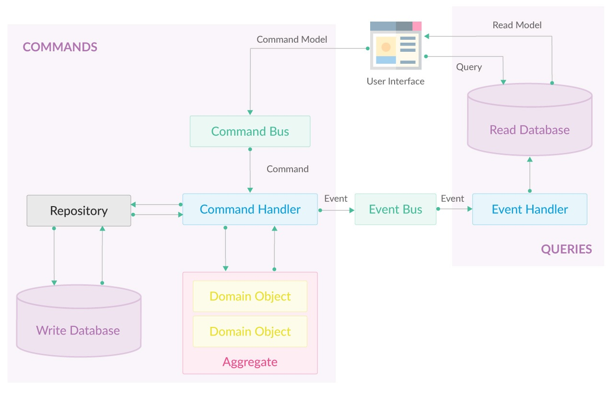

# Design di dettaglio
In questo capitolo mostreremo in dettaglio quelle che sono le scelte di design del sistema, partendo dal design architetturale descritto nel capitolo precedente.

## Elementi del dominio
## Paziente

Il paziente all'interno del sistema risulta essere il concetto principale, in quanto è il fulcro del nostro progetto.
Il sistema deve fornire una copia digitale del paziente fisico. L'astrazione scelta per rappresentare questo requisito risulta essere perciò il Digital Twin, che permette di disporre di un gemello digitale di un asset fisico su cui poter effettuare simulazioni e previsioni, attraverso i dati che lo rappresentano.

### Digital Twin del paziente
Durante questa fase, ci siamo interrogati molto su quale fosse il modo migliore di progettare un Digital Twin in questo contesto. Per le nostre esigenze, esso non sarebbe infatti servito ad effettuare simulazioni ma solo previsioni, inoltre non vi è un flusso continuo di informazioni provenienti da eventuali sensori. Lo storico clinico del paziente viene aggiornato dalle figure professionali preposte, che si trovano ad interagire con esso.

Visti i requisiti richiesti dalla nostra applicazione, l’obiettivo è quello di modellare il Digital Twin di un paziente, raccogliendo informazioni importanti per quest'ultimo ma anche per le figure professionali che sono preposte a prendersi cura di lui, al fine di monitorarne lo storico, aggiornarlo e prevedere possibili eventi futuri.

Abbiamo quindi pensato ad un Digital Twin suddiviso in due parti:
- data oriented
- behaviour oriented

#### Data Oriented
Questa componente si occupa di memorizzare e gestire lo storico delle informazioni di un paziente:
- informazioni generali, come ad esempio gruppo sanguigno e allergie
- cartelle cliniche
- informazioni del medico di base, come visite e prescrizioni
- visite cardiologiche

In questa sezione essendo mantenuti i dati riguardanti il paziente, per effettuare una modellazione corretta di ogni singolo concetto e implementare codice con un'alta manutenibilità, abbiamo applicato i *tactical patterns*.
Ogni concetto del sotto dominio è stato quindi classificato come value objects, entity o service in base alle proprie caratteristiche.

#### Behaviour oriented
La parte behaviour oriented è incentrata sui comportamenti del Digital Twin, intesi come monitoraggio e previsione. In questa seconda parte abbiamo identificato i seguenti task:
- predizione di malattie
- avvisi al paziente, come ad esempio ricordare una visita prenotata

Questa parte del Digital Twin trova la soluzione ottimale nella modellazione ad attori, in quanto necessita di avere un proprio flusso interno di controllo nel quale andare ad effettuare i task preposti.

## Figure mediche professionali
Le restanti figure mediche presenti nel sistema hanno subito una modellazione differente. 
Su di esse non era puntato il focus dell'esperto del dominio con cui abbiamo interagito.
Tali figure, sotto elencate:
- Medico di base
- Medico Specialista (Chirurgo)
- Strumentista
- Anestesista
- Infermiere di reparto
- Soccorritore

sono state progettate come microservizi.
La comunicazione tra essi e la persona fisica avviene tramite scambio di messaggi, forniti dall'interfaccia del servizio. La comunicazione con gli altri microservizi invece avviene tramite le REST API.

## Pattern di progettazione
Il team ha cercato di utilizzare il più possibile i pattern di progettazione, al fine di rendere il codice allo stato dell'arte. In aggiunta ai tactical patterns, utilizzati nella modellazione della parte data oriented del Digital Twin, sono stati utilizzati anche i seguenti pattern.

### Pattern Factory
Il pattern Factory è risultato adatto al nostro progetto per la creazione delle figure del dominio, sia per quanto riguarda il paziente che per le figure mediche professionali.
La factory ci consente di non far trasparire, in fase di implementazione, la complessità di definizione di queste entità.

### CQRS patterns
Per la parte di persistenza è stato applicato il pattern CQRS il quale consente di ottenere svariati vantaggi.
Il Command Query Responsibility Segregation pattern separa il modello di dominio in due sottomodelli:
- *Read model*
- *Write model*

La divisione viene fatta per permettere di soddisfare i bisogni di un context senza comprometterlo. Lo stato del dominio viene fornito dal Read model, mentre i business task sono eseguiti dal Write model.
CQRS è un valido aiuto nella gestione della complessità, in quanto divide la parte di presentazione da quella transazionale.
- *Commands* → (write), responsabilità di compiere un business task che viene invocato dal cliente.
- *Queries* → (read), responsabilità di realizzare un report, il quale viene richiesto dal cliente.

#### Command side
Questo lato rappresenta la parte di logica del dominio per soddisfare i business tasks.
Passano di qui, solo i casi d'uso che richiedono un accesso in scrittura al modello del dominio (generazione eventi, generazione workflow) ma non gli aspetti relativi alla visualizzazione. 

#### Query side
Lato sviluppato per effettuare il reporting del dominio.
I dati sono memorizzati come eventi, secondo il principio dell'event sourcing.
Questo permette di mantenere l'evoluzione temporale del sistema, sulla base di tutti gli eventi precedentemente avvenuti.
Per realizzare il report, richiesto attraverso una query, viene ricreato lo stato dell'elemento sfruttando tutti gli eventi trascorsi dall'avvio del sistema fino al momento attuale.
I domain objects che vengono poi ritornati sono semplici DTO, che mostrano ciò che è stato richiesto.

### Pattern Repository
La progettazione dei repository è stata necessaria nel sistema, sia lato read model che lato write model. Il suo obiettivo è quello di nascondere la complessità di gestione dei database all'interno della realizzazione del pattern CQRS.

[<-- Home](../README.md)